# 🍳 CIQUAL Food Search Engine – RAG‑Powered Semantic Search 🍜

A complete food search engine using **French CIQUAL nutritional data**, stored in **PostgreSQL + pgvector**.
Provides **semantic vector search** and a **RAG endpoint** ready for multimodal LLMs (e.g., Ollama’s LLaVA).

---

## Table of Contents

- [Dataset Overview](#dataset-overview)
  - [Excel Files Structure](#excel-files-structure)
  - [XML Files Structure](#xml-files-structure)
- [System Architecture](#system-architecture)
  - [Understanding the Full Flow](#understanding-the-full-flow)
  - [Components](#components)
  - [Features](#features)
- [PostgreSQL Database Schema](#postgresql-database-schema)
- [Requirements](#requirements)
- [Installation &amp; Setup](#installation--setup)
  - [1. Clone this repository ](#1-clone-this-repository)
  - [2. Create and activate a virtual environment](#2-create-and-activate-a-virtual-environment)
  - [3. Install the Ciqual ETL and RAG Packages](#3-install-the-ciqual-etl-and-rag-packages)
  - [4. Start PostgreSQL with pgvector extension (Docker)](#4-start-postgresql-with-pgvector-extension-docker)
- [Usage Instructions](#usage-instructions)
  - [Enrich the 2025 Ciqual Dataset](#enrich-the-2025-ciqual-dataset)
  - [Import Ciqual Data into PostgreSQL](#import-ciqual-data-into-postgresql)
  - [Generate Text Embedding from Ciqual Data](#generate-text-embedding-from-ciqual-data)
  - [Food Search Engine (one‑time)](#food-search-engine-onetime)
- [Start ETL Pipeline API Server](#start-etl-pipeline-api-server)
  - [ETL API Endpoints](#etl-api-endpoints)
  - [Error Handling Examples](#error-handling-examples)
  - [Query Examples](#query-examples)
- [Start RAG API Server](#start-rag-api-server)
  - [Prerequisites](#prerequisites)
  - [RAG API Endpoints](#rag-api-endpoints)
- [Run the Gradio App](#run-the-gradio-app)
- [Performance &amp; Indexing](#performance--indexing)
- [Future Extensions](#future-extensions)
- [Troubleshoot](#troubleshoot)
  - [Connect to PostgreSQL](#connect-to-postgresql)
  - [Enable pgVector Extension](#enable-pgvector-extension)
- [References](#references)

---

## Dataset Overview

This project uses nutritional data from [CIQUAL (ANSES)](https://ciqual.anses.fr/), French Food Composition Table.

- **Source**: [ANSES CIQUAL](https://ciqual.anses.fr/)
- **License**: [Open Data Commons Open Database License (ODbL)](https://opendatacommons.org/licenses/odbl/) – distributed as Open Data via [data.gouv.fr](https://entrepot.recherche.data.gouv.fr/dataset.xhtml?persistentId=doi%3A10.57745%2FRDMHWY)[[1][1]]
- **Usage in this project**: Core nutritional data stored in PostgreSQL.

### Excel Files Structure

The Excel file Table `Ciqual 2025_ENG_2025_11_03.xls/.xlsx` contains two tabs:

1. `food composition` tab - Denormalized wide table with:

- 3,484 foods (rows) × 74 components (columns).
- Food metadata columns: `alim_code`, `alim_nom_eng`, `alim_nom_sci`, `alim_grp_code`, `alim_ssgrp_code`, `alim_ssssgrp_code`, `alim_grp_nom_eng`, `alim_ssgrp_nom_eng`, `alim_ssssgrp_nom_eng`, `Jones_factor`, `N(g/100g)*Jones_factor`
- 74 component columns (values + units in headers)

2. `INFOODS codes` tab - Component mapping table:

- `INFOODS_code`, `const_code`, `const_nom_eng`

### XML Files Structure

The XML files provide a normalized relational structure with 5 files:

| File                    | Content               | Key Fields                                                                                                                                           |
| ----------------------- | --------------------- | ---------------------------------------------------------------------------------------------------------------------------------------------------- |
| alim_2025_11_03.xml     | List of foods         | `alim_code`, `alim_nom_eng`, `alim_nom_fr`, `alim_nom_sci`, `alim_grp_code`, `alim_ssgrp_code`, `alim_ssssgrp_code`, `facteur_jones` |
| alim_grp_2025_11_03.xml | Food group hierarchy  | `alim_grp_code`, `alim_ssgrp_code`, `alim_ssssgrp_code`, `group names (EN/FR)`                                                               |
| compo_2025_11_03.xml    | Composition values    | `alim_code`, `const_code`, `teneur`, `min`, `max`, `code_confiance`, `source_code`                                                     |
| const_2025_11_03.xml    | Component definitions | `const_code`, `const_nom_eng`, `const_nom_fr`, `code_INFOODS`                                                                                |
| sources_2025_11_03.xml  | Data sources          | `source_code`, `ref_citation`                                                                                                                    |

This project uses normalized XML files as data sources for structured data.

---

## System Architecture

### Understanding the Full Flow

**1. CIQUAL ETL Pipeline (`src/ciqual_etl`)**

* **Ingestion:** Reads the French nutritional dataset (CIQUAL) from CSV or API.
* **Cleaning & Enrichment:** Standardizes food names, nutritional values, and categories.
* **Embedding Generation:** Uses a text embedding model (e.g., `sentence-transformers/all-MiniLM-L6-v2`) to create vector representations of food descriptions.
* **Storage:** Stores the enriched data (name, nutrients, description, embedding) into **PostgreSQL with pgvector** for fast similarity search.

**2. RAG System (`src/rag`)**

* **Retriever (`Retriever` class):**
  * Connects to the pgvector database.
  * Converts the user’s query into an embedding and performs a cosine similarity search to retrieve the top‑k most similar food records.
* **Prompt Builder (`PromptBuilder` class):**
  * Constructs system and user prompts.
  * Supports multimodal prompts (text + images) for vision‑language models.
* **LLM Client (`LLMClient` class):**
  * Wraps an LLM (e.g., Ollama, OpenAI).
  * Provides `generate()` for text‑only and `generate_multimodal()` for text+image inputs.
* **RAG Pipeline (`RAGPipeline` class):**
  * Orchestrates the entire flow: retrieve → build prompt → generate answer.
  * Has `query()` for text‑only and `query_multimodal()` for text+image.

**3. FastAPI Endpoint (`/rag/multimodal`)**

* Receives the user’s question, an image, and parameters (`top_k`, `model`, `temperature`).
* Calls `rag_pipeline.query_multimodal(question, images=[pil_image], top_k=top_k, model=model, temperature=temperature)`.
* Returns the answer and retrieved documents.

---

### Components

- **PostgreSQL + pgvector**[[2][2],[3][3]]: Stores foods, nutrition, image URLs, and 384‑dim vectors. Enables cosine similarity search via IVFFlat index.
- **Sentence‑Transformers** [[4][4]]: Converts text queries and food descriptions into vectors.
- **FastAPI** [[5][5]]: REST API for semantic search and RAG.
- **Ollama** [[6][6]]: Local LLM server. The `/rag` endpoint retrieves relevant foods, builds a context prompt, and asks the LLM.

---

### Features

- Semantic search using cosine similarity on pgvector.
- IVFFlat index for fast approximate nearest neighbour search.
- FastAPI endpoints with auto‑generated OpenAPI docs (`/docs`)
- RAG endpoint that integrates retrieved foods with Ollama (multimodal models like LLaVA).

---

## PostgreSQL Database Schema

The PostgreSQL database schema is described in [Figure 1](#fig1).

<figure id="fig1">
  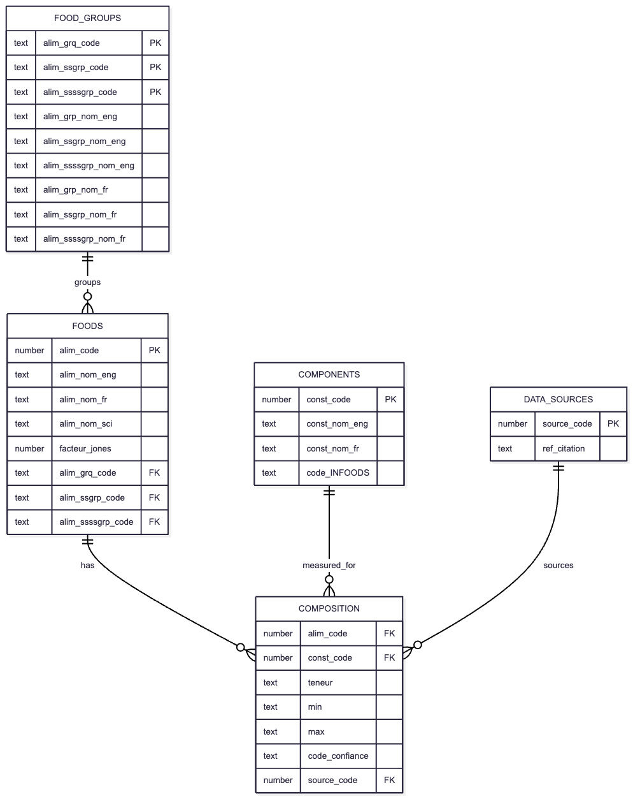
  <figcaption>Figure 1: Ciqual ER-Diagram.</figcaption>
</figure>

---

## Requirements

- **Python** 3.9+
- **PostgreSQL** 14+ with **pgvector** extension installed. `pgvector` is the PostgreSQL extension to perform vector search.
- **Docker** (recommended for pgvector)

Python packages (install via `pip` or `uv` – see [Installation and Setup](#installation--setup)).

---

## Installation & Setup

### 1. Clone this repository

```bash
git clone https://github.com/tantikristanti/Generative-AI-LLMs/tree/main/food-nutrition-semantic-search-rag

cd food-nutrition-semantic-search-rag
```

---

### 2. Create and activate a virtual environment

```bash
python -m venv .venv
# or with uv:
uv venv .venv

source .venv/bin/activate   # Linux/macOS
# .venv\Scripts\activate   on Windows
```

---

### 3. Install the Ciqual ETL and RAG Packages

Install the Ciqual ETL package to use them cleanly in other modules.

- `-e` stands for editable mode. The package is installed in place, so changes to the source code are immediately reflected without reinstalling.
- `.` refers to the current directory (which should contain a pyproject.toml or setup.py).

```bash
# Install the package with pip
pip install -e .

# Or using uv
uv pip install -e .
```

---

### 4. Start PostgreSQL with pgvector extension (Docker)

You can run PostgreSQL with the pgvector extension either directly with Docker or by using Docker Compose.

**Option 1: Run PostgreSQL with Docker**

When starting the container:

- Use `--name` to assign a meaningful name to the container. This makes it easier to manage and reference the container later using commands such as docker start, docker stop, docker logs, and docker exec.
- Configure the database credentials and settings using environment variables (`-e`) or load them from a `.env` file with `--env-file`.
- Expose PostgreSQL by mapping a host port to the container port using the format `[HOST_PORT:CONTAINER_PORT]`. PostgreSQL listens on port `5432` inside the container by default. If port `5432` is already in use on the host, you can map it to another port such as `5431`.
- Mount a persistent volume using `-v` to ensure that database data is retained even if the container is stopped, recreated, or removed.

```bash
docker run -d --name pgvector \
  -e POSTGRES_USER=ciqual \
  -e POSTGRES_PASSWORD=ciqual \
  -e POSTGRES_DB=ciqual \
  -v ciqual_data:/var/lib/postgresql/data \
  -p 5432:5432 \
  pgvector/pgvector:pg18
```

The `pgvector/pgvector:pg18` image includes both PostgreSQL and the `pgvector` extension, so no additional installation steps are required.

**Verify Running Containers**

List all running containers:

```bash
docker ps
```

---

## Usage Instructions

### Enrich the 2025 Ciqual Dataset

This script enriches the `Table Ciqual 2025_ENG_2025_11_03.xls` dataset by adding French food names and food group labels extracted from the Ciqual XML files.

**Display available command-line arguments**

```bash
uv run python python-scripts/enrich-table-ciqual-fr-food-name.py --help
```

**Run with custom input and output paths**

```bash
# Display available command-line arguments 
uv run python python-scripts/enrich-table-ciqual-fr-food-name.py --help 

# Run with custom input and output paths 
uv run python python-scripts/enrich-table-ciqual-fr-food-name.py \ 
  --excel-path "file1.xlsx" \ 
  --xml-path "file2.xml" \ 
  --xml-grp-path "file3.xml" \ 
  --output-csv-path "out1.csv" \ 
  --output-pq-path "out2.parquet"

```

### Import Ciqual Data into PostgreSQL

This script parses the Ciqual XML files and loads the data into PostgreSQL tables.

```bash
# Run the pipeline from the parent directory `ciqual-food-rag-semantic-search` by treating ciqual_etl directory as a package and resolves the imports correctly.
# The -m flag in Python stands for “module”. It tells Python to run a module as if it were a script, rather than running a file directly by its path.

# Display available command-line arguments 
uv run python -m ciqual_etl.run_ciqual_etl --help

# Import data from the specified Ciqual XML directory 
# uv run python -m ciqual_etl.run_ciqual_etl --xml_dir [/path/to/xml]
uv run python -m ciqual_etl.run_ciqual_etl \
  --xml-dir "data/ciqual" 
  
# Clear existing table data before importing 
uv run python -m ciqual_etl.run_ciqual_etl \
  --xml_dir "data/ciqual" \
  --clear
```

### Generate Text Embedding from Ciqual Data

This script parses the Ciqual CSV file and loads the data into PostgreSQL DB.

CLI for building Ciqual food embeddings.

```bash
# Import data from the specified pre-processed Ciqual CSV directory 
uv run python -m ciqual_etl.run_ciqual_embeddings \
    --csv "data/ciqual/pre-processed/table-ciqual-2025-11-03-with-fr-food-name.csv" 

# Drop existing table before creating
uv run python -m ciqual_etl.run_ciqual_embeddings \
    --csv "data/ciqual/pre-processed/table-ciqual-2025-11-03-with-fr-food-name.csv" \
    --drop
```

### Food Search Engine (one‑time)

```bash
uv run python -m ciqual_etl.run_food_search_engine \
  --query "poisson riche en oméga 3"
```

We will get the following results:

```
=== Search Results ===
Food: Accra de poisson, préemballé (code 25433) | similarity: 0.598
Text snippet: alim_grp_code: 4
alim_ssgrp_code: 409
alim_ssssgrp_code: 0
alim_grp_nom_eng: meat, egg and fish
alim_ssgrp_nom_eng: fish products
alim_ssssgrp_nom_eng: -
alim_code: 25433
alim_nom_eng: Caribbean-style...

Food: Carpaccio de saumon avec marinade, fait maison (code 25537) | similarity: 0.587
Text snippet: alim_grp_code: 4
alim_ssgrp_code: 409
alim_ssssgrp_code: 0
alim_grp_nom_eng: meat, egg and fish
alim_ssgrp_nom_eng: fish products
alim_ssssgrp_nom_eng: -
alim_code: 25537
alim_nom_eng: Salmon carpacci...

Food: Terrine de fruits de mer (par ex. de Saint-Jacques), avec ou sans poisson, préemballée (code 8292) | similarity: 0.5792
Text snippet: alim_grp_code: 4
alim_ssgrp_code: 409
alim_ssssgrp_code: 0
alim_grp_nom_eng: meat, egg and fish
alim_ssgrp_nom_eng: fish products
alim_ssssgrp_nom_eng: -
alim_code: 8292
alim_nom_eng: Seafood terrine,...

Food: Truite saumonée, sautée/poêlée (code 26998) | similarity: 0.5626
Text snippet: alim_grp_code: 4
alim_ssgrp_code: 405
alim_ssssgrp_code: 0
alim_grp_nom_eng: meat, egg and fish
alim_ssgrp_nom_eng: fish, cooked
alim_ssssgrp_nom_eng: -
alim_code: 26998
alim_nom_eng: Salmon trout, sa...

Food: Surimi, bâtonnets, tranche ou râpé saveur crabe (code 26046) | similarity: 0.5601
Text snippet: alim_grp_code: 4
alim_ssgrp_code: 409
alim_ssssgrp_code: 0
alim_grp_nom_eng: meat, egg and fish
alim_ssgrp_nom_eng: fish products
alim_ssssgrp_nom_eng: -
alim_code: 26046
alim_nom_eng: Surimi, on stic...
```

---

## Start ETL Pipeline API Server

```bash
uv run uvicorn ciqual_etl.fastapi_app:app --reload --port 8000
```

> Uvicorn running on http://127.0.0.1:8000 (Press CTRL+C to quit)

This will run server at http://localhost:8000 with interactive API documentation at http://localhost:8000/docs.

### ETL API Endpoints

| Method | Path    | Description                                           |
| ------ | ------- | ----------------------------------------------------- |
| GET    | /health | Health check & API info.                              |
| GET    | /docs   | Auto‑generated Swagger UI documentation.             |
| GET    | /search | Semantic vector search (params:`query`, `top_k`). |
| POST   | /search | Semantic vector search (params:`query`, `top_k`). |

***1. Health Check Endpoint (GET)***

- `GET` -> http://localhost:8000/health
- Expected response (status 200), [Figure 2](#fig2):

```json
{ "status": "ok" }
```

<figure id="fig2">
  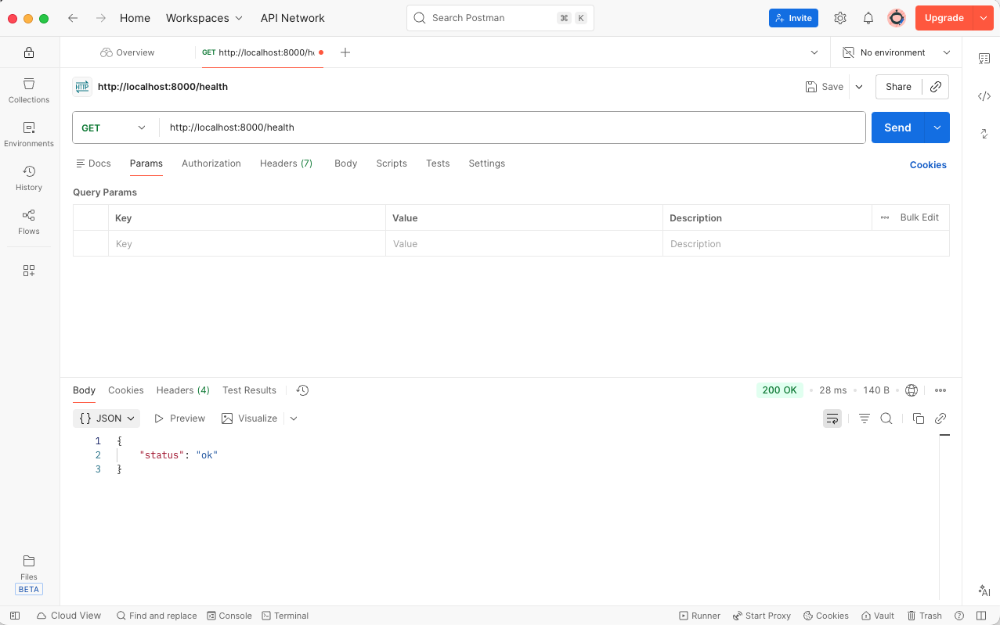
  <figcaption>Figure 2: Health Check Endpoint (GET).</figcaption>
</figure>

***2. Search Endpoint – GET version***

- `GET` -> `http://localhost:8000/search?query=Aliment riche en protéines et faible en matières grasses&top_k=5`
- `URL`: `http://localhost:8000/search`
- Parameters, [Figure 3](#fig3):
  - `query`: `Aliment riche en protéines et faible en matières grasses`
  - `top_k`: `5`

<figure id="fig3">
  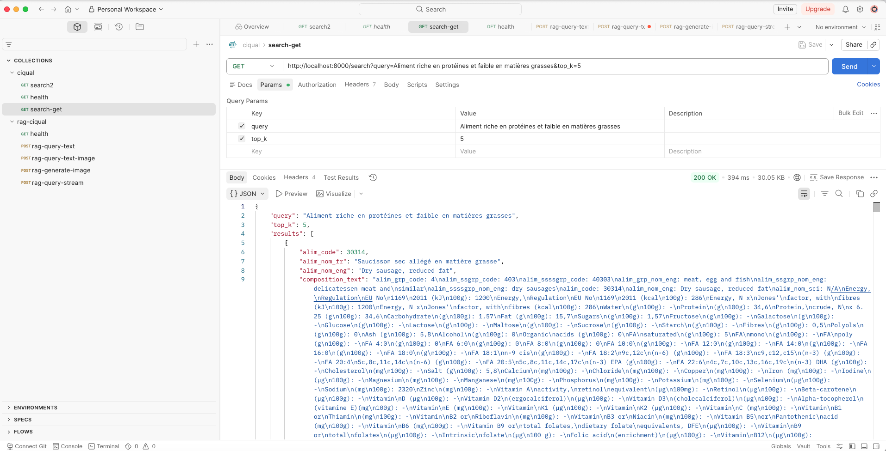
  <figcaption>Figure 3: Search Endpoint (GET).</figcaption>
</figure>

***3. Search Endpoint – POST version***

- Purpose: Send the query in the request body (more structured, supports larger payloads), [Figure 4](#fig4).
- `URL` -> `http://localhost:8000/search`
- Headers:
  - `Key`: `Content-Type`
  - `Value`: `application/json`
- Body:
  - Raw → JSON

```json
{
  "query": "Aliment riche en protéines et faible en matières grasses",
  "top_k": 5
}
```

<figure id="fig4">
  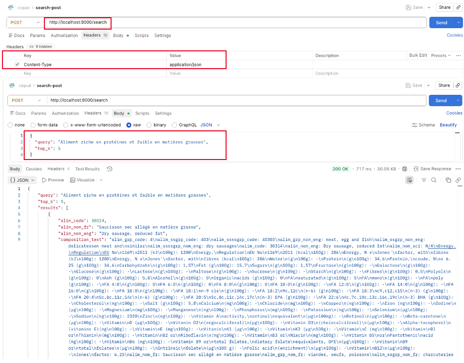
  <figcaption>Figure 4: Search Endpoint (POST).</figcaption>
</figure>

**Response for both query versions (GET/POST)**:

```json
{
  "query":"poisson gras oméga 3",
  "top_k":5,"results":
  [
    {"alim_code":25433,
    "alim_nom_fr":"Accra de poisson, préemballé",
    "alim_nom_eng":"Caribbean-style fish fritters, fish acras,prepacked",
    "composition_text":"alim_grp_code: 4\nalim_ssgrp_code: 409\nalim_ssssgrp_code: 0\nalim_grp_nom_eng: meat, egg and fish\nalim_ssgrp_nom_eng: fish products\nalim_ssssgrp_nom_eng: -\nalim_code: 25433\nalim_nom_eng: Caribbean-style fish fritters, fish acras, prepacked\nalim_nom_sci: (Genus and species unknown or multiple)\n...alim_nom_fr: Accra de poisson, préemballé\nalim_grp_nom_fr: viandes, oeufs, poissons\nalim_ssgrp_nom_fr: produits à base de poissons et produits de la mer",
    "metadata":{"alim_code":25433,"alim_nom_fr":"Accra de poisson, préemballé","alim_nom_eng":"Caribbean-style fish fritters, fish acras,\nprepacked"},
    "similarity":0.613},
    ...
  ]
}
```

### Error Handling Examples

***Invalid top_k***

- POST request with top_k = 0 (invalid, must be ≥1):

```json
{ "query": "healthy", "top_k": 0 }

```

- Expected response (status 422):

```json
{
    "detail": [
        {
            "type": "greater_than_equal",
            "loc": [
                "body",
                "top_k"
            ],
            "msg": "Input should be greater than or equal to 1",
            "input": 0,
            "ctx": {
                "ge": 1
            }
        }
    ]
}
```

### Query Examples

- French:
  - "Poisson gras oméga 3"
  - "Aliment riche en protéines et faible en matières grasses"
  - "Fruit avec beaucoup de vitamine
- English:
  - "High calcium food for bone health"
  - "Low carbohydrate vegetables"
  - "Foods with high iron content"

---

## Start RAG API Server

### Prerequisites

* Ensure the PostgreSQL database is running and contains the food embedding data.
* Ensure Ollama is running locally (default `http://localhost:11434`) with the models we want to use (e.g., `llama3.2`, `llava` for multimodal).
* The server is started with:

```bash
uv run uvicorn rag.rag_fastapi_app:app --reload --port 8000
```

> Uvicorn running on http://127.0.0.1:8000 (Press CTRL+C to quit)

The `--reload` flag is optional but helpful during development.

Wait until you see `Application startup complete.` in the logs. You can verify the API is healthy by visiting `http://localhost:8000/health` in your browser or using `curl`.

### RAG API Endpoints

| Method | Path                | Description                                                                     |
| ------ | ------------------- | ------------------------------------------------------------------------------- |
| GET    | /health             | Health check & API info.                                                        |
| GET    | /docs               | Auto‑generated Swagger UI documentation.                                       |
| POST   | /rag/query          | Query the RAG system with text (params:`query`, `top_k`).                   |
| POST   | /rag/multimodal     | Multimodal Query (Text + Image) (params:`query`, `image`, `top_k`).       |
| POST   | /rag/generate-image | Generate Food Image (Text‑to‑Image) (params:`query`, `image`, `top_k`). |

***1. Health Check Endpoint***

- **Endpoint**: `GET /health`

> curl

```bash
curl http://localhost:8000/health
```

> Postman

* Method: `GET`
* URL: `http://localhost:8000/health`
* No body required.

- **Expected response:**

```json
{
  "status": "ok",
  "database": "connected"
}
```

***2. RAG Query (Text Only)***

- **Endpoint**: `POST /rag/query`
- **Content-Type**: `application/json`

> curl

```bash
curl -X POST "http://localhost:8000/rag/query" \
  -H "Content-Type: application/json" \
  -d '{
        "query": "What are the nutritional values of the mixed salad with fish?",
        "top_k": 5,
        "model": "llama3.2",
        "temperature": 0.7
    }'
```

You can omit model and temperature; they default to None and 0.7 respectively.

> Postman

- Method: `POST`
- URL: `http://localhost:8000/rag/query`
- Headers: `Content-Type: application/`json
- Body: raw JSON (example above).
- **Expected response:**

```json
{
  "query": "What are the nutritional values of the mixed salad with fish?",
  "answer": "Based on the retrieved data, the nutritional values for the Mixed Salad with Fish (Salade composée avec viande ou poisson, appertisée) are:\n\n* Energy: 458 kJ per 100g\n* Protein: 8g per 100g\n* Fat: 5g per 100g\n* Carbohydrate: 6g per 100g\n* Sugars: 1g per 100g\n\nNote that the provided data does not specify the exact type of fish, so we cannot provide its individual nutritional values...",
  "documents": [
    {
      "food": "Salade composée avec viande ou poisson, appertisée",
      "score": 0.455,
      "content": "alim_grp_code: 1\nalim_ssgrp_code: 101\nalim_ssssgrp_code: 0\nalim_grp_nom_eng: starters and dishes\nalim_ssgrp_nom_eng: mixed salads\nalim_ssssgrp_nom_eng: -\nalim_code: 25602\nalim_nom_eng: Mixed salad, with meat/fish, canned\nalim_nom_sci: N/A\nEnergy,\nRegulation\nEU No\n1169\n2011 (kJ\n100g): 458\nEnergy,\nRegulation\nEU No\n1169\n2011 (kcal\n100g): 110\nEnergy, N x\nJones'\nfactor, with\nfibres (kJ\n100g): 458\nEnergy, N x\nJones'\nfactor, with\nfibres (kcal\n100g): 110\nWater\n(g\n100g): 76,7\nProtein\n(g\n100g): 8,06\nProte...",
      "image_url": null
    }
  ],
  "model": "llama3.2"
}
```

***3. Multimodal Query (Text + Image)***

- **Endpoint:** `POST /rag/multimodal`
- **Content-Type:** `multipart/form-data`

This endpoint expects an image file and a text query. The image is used by a vision model (like LLaVA) to generate a description that is combined
with the RAG retrieval.

> curl

```bash
curl -X POST "http://localhost:8000/rag/multimodal" \
  -F "query=What food is this and what are its nutritional values?" \
  -F "image=@/path/to/your/food_image.jpg" \
  -F "top_k=5" \
  -F "model=llava" \
  -F "temperature=0.7"
```

Adjust the image path and model name (should support vision, e.g., `llava`).

> Postman

* Method: `POST`
* URL: `http://localhost:8000/rag/multimodal`
* Headers: (Postman will set `Content-Type` automatically)
* Body: select **form-data**
* Parameters and add keys:
  * `query` (Text) - add the text (e.g., "Describe this photo")
  * `image` (File) – choose a JPEG/PNG file from your machine
  * `top_k` (Text, optional)
  * `model` (Text, optional)
  * `temperature` (Text, optional)

**Expected response:** Same structure as the text query, but the answer may incorporate information from the image, [Figure 5](#fig5) and [Figure 6](#fig6).

```json
{
  "query": "Describe this photo",
  "answer": " The image shows a whole cooked fish placed on a white plate. The fish appears to be medium-sized with a dark skin and lighter flesh. It's garnished with what looks like fennel seeds sprinkled over it. In the background, there are people who appear to be seated around a dining table, suggesting that this might have been taken in a restaurant or at home during a meal. The image is not very clear, but you can see the person's hands on the table and some items like a cup and possibly a napkin. ",
  "documents": [],
  "model": "llava"
}
```

<figure id="fig5">
  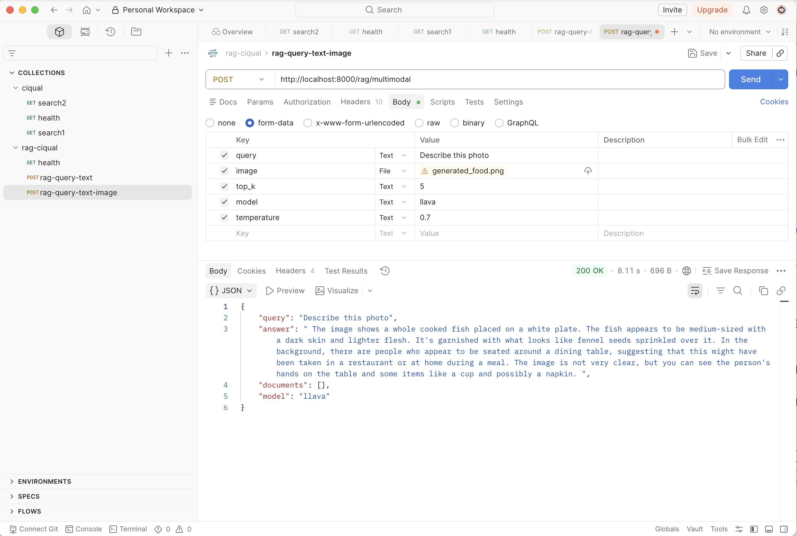
  <figcaption>Figure 5: Multimodal RAG Endpoint (POST).</figcaption>
</figure>

```json
{
  "query": "Describe this photo",
  "answer": " This appears to be a photograph of a jar of Nutella, which is a popular hazelnut cocoa spread. The jar is placed on what looks like a kitchen counter, and you can see a reflection in the surface below it. The label \"NUTELLA\" is prominently displayed on the front of the jar, along with an image of hazelnuts. Additionally, there is a small illustration of a hazelnut tree and a cluster of hazelnuts on the jar's label. There are no visible signs indicating the quantity or brand, but this suggests that it is a product from the Nutella brand, which is made by Ferrero Rocher. ",
  "documents": [],
  "model": "llava"
}
```

<figure id="fig6">
  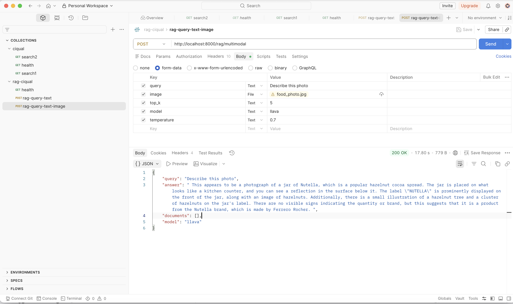
  <figcaption>Figure 6: Multimodal RAG Endpoint (POST).</figcaption>
</figure>

***4. Generate Food Image (Text‑to‑Image)***

**Endpoint:**`POST /rag/generate-image`
**Content-Type:**`multipart/form-data`

This endpoint generates a food image from a text description using a generative model (like Stable Diffusion via Ollama’s `llama3.2-vision` or similar). The response is a PNG image file.

> curl

```bash
curl -X POST "http://localhost:8000/rag/generate-image" \
  -F "description=a plate of salmon with roasted vegetables" \
  -F "model=llama3.2-vision" \
  --output salmon_download.png
```

The `--output` saves the PNG file locally.

> Postman

* Method: `POST`
* URL: `http://localhost:8000/rag/generate-image`
* Body:  **form-data** with:

  * `description` (Text)
  * `model` (Text, optional)
  * `out_file` (Text, optional)
* After sending, click **Save Response** → **Save to a file** to download the image.

**Expected response:** A binary PNG image, [Figure 7](#fig7) and [Figure 8](#fig8). (If the model is not available, you’ll get a 500 error.)

<figure id="fig7">
  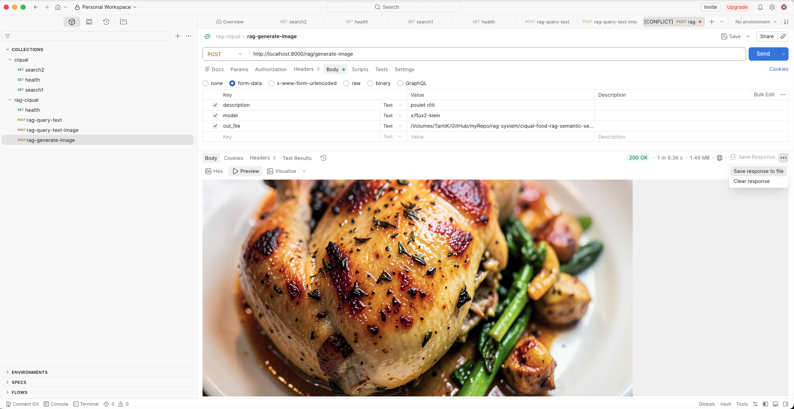
  <figcaption>Figure 7: Generate Image RAG Endpoint (POST) - Poulet Rôti.</figcaption>
</figure>

<figure id="fig8">
  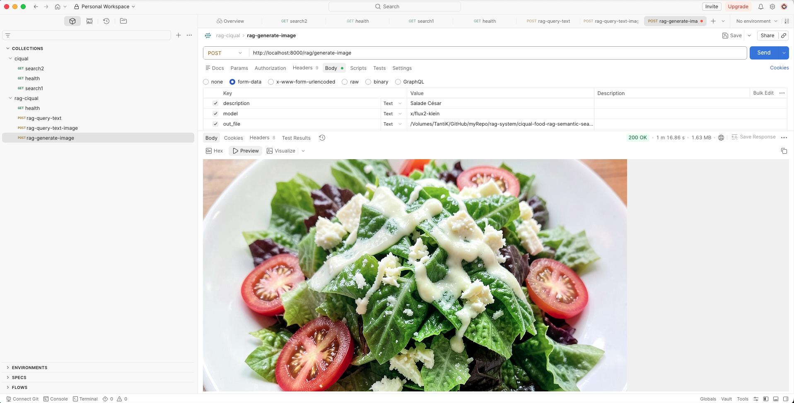
  <figcaption>Figure 8: Generate Image RAG Endpoint (POST) - Salade César.</figcaption>
</figure>

---

***5. Streaming RAG Response***

**Endpoint:**`POST /rag/stream`
**Content-Type:**`application/json`

This endpoint streams the LLM response token by token, which is useful for chat‑like user interfaces.

> curl

```bash
curl -X POST "http://localhost:8000/rag/stream" \
  -H "Content-Type: application/json" \
  -d '{
    "query": "List the top 3 foods rich in vitamin C.",
    "top_k": 3,
    "model": "llama3.2",
    "temperature": 0.5
  }'
```

The output will be a continuous stream of text tokens (newline‑separated or plain). You’ll see chunks arriving one after another.

> Postman

* Method: `POST`
* URL: `http://localhost:8000/rag/stream`
* Headers: `Content-Type: application/json`
* Body: raw JSON (same as query).
* In Postman, the response will appear gradually as text.

**Expected response:** The answer is streamed as plain text, not a JSON object.

---

## Run the Gradio App

Before launching the Gradio interface, make sure all required services are running.

**1. Verify that PostgreSQL is running**

Check that the PostgreSQL container is up and running:

```bash
docker ps
```

If PostgreSQL is not listed, start the database before proceeding.

**2. Start the RAG API service**

The Gradio app depends on the RAG backend, which must be running first. Start the FastAPI server with:

```bash
uvicorn rag.rag_fastapi_app:app --reload --port 8000
```

Once started, the RAG service will be available at `http://localhost:8000`.

**3. Launch the Gradio application**

Open a new terminal and navigate to the directory containing `gradio_app.py` (`src/front-end/`). Then run:

```bash
uv run python src/front-end/gradio_app.py
```

**4. Access the application**

After the application starts, you should see output similar to:

```bash
* Running on local URL:  http://0.0.0.0:7860
```

Open the displayed URL in your browser to access the Gradio interface.

The application provides the following tabs:

* **Text Query** – Query the RAG system using text input, [Figure 9](#fig9).

<figure id="fig9">
  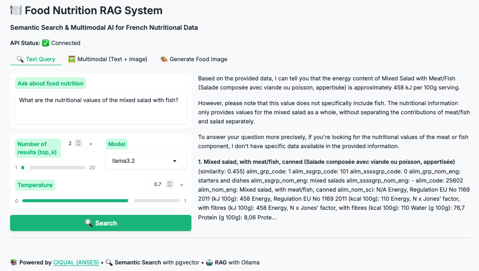
  <figcaption>Figure 9: Gradio-Based Interface for the Food RAG System (text based).</figcaption>
</figure>

* **Multimodal (Text + Image)** – Submit both text and image inputs, [Figure 10](#fig10).

<figure id="fig10">
  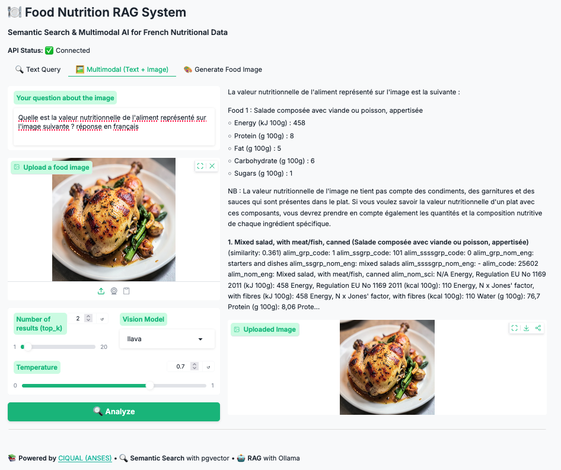
  <figcaption>Figure 10: Gradio-Based Interface for the Food RAG System (multimodal).</figcaption>
</figure>

* **Generate Food Image** – Generate food images from text prompts, [Figure 11](#fig11).

<figure id="fig11">
  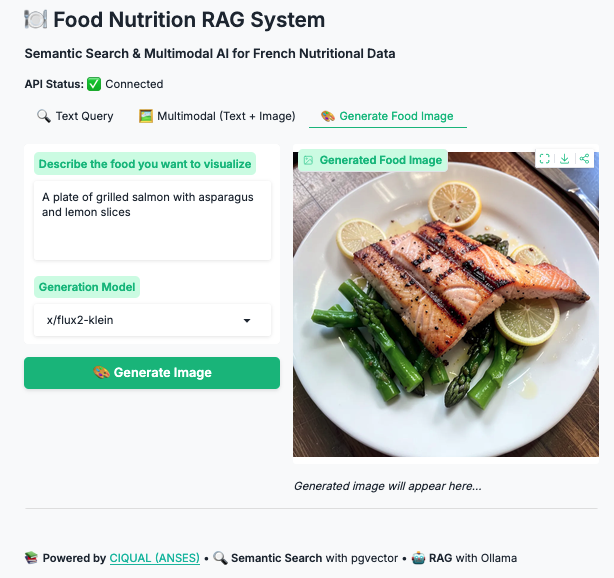
  <figcaption>Figure 11: Gradio-Based Interface for the Food RAG System (generate food image).</figcaption>
</figure>

---

## Performance & Indexing

- **Index type**: ***IVFFlat index*** on the `embedding` column with cosine distance operator (<=>).
- **Number of lists**: Automatically set to `sqrt(row_count)`.
- **For larger datasets (>100k rows), we need to consider switching to `HNSW index` (pgvector supports both).
- Example of creating an HNSW index manually:

```sql
CREATE INDEX ON foods USING hnsw (embedding vector_cosine_ops);
```

- **IVFFlat vs HNSW** – detailed study: [PGVector: HNSW vs IVFFlat](https://medium.com/@bavalpreetsinghh/pgvector-hnsw-vs-ivfflat-a-comprehensive-study-21ce0aaab931)[[4][4]]

---

## Future Extensions

- **User feedback loop**: Log user clicks to fine‑tune embeddings.
- **Full‑text + hybrid search**: Combine vector similarity with BM25 (`pgvector` sparse vectors or `pg_trgm`).
- **Periodic updates**: Automatically refresh `CIQUAL` when new versions are released.

---

## Troubleshoot

### Connect to PostgreSQL

```bash
docker exec -it postgres psql -U db_user_name -d db_name
```

For example:

```bash
docker exec -it postgres psql -U ciqual -d ciqual_db
```

### Enable pgVector Extension

```sql
CREATE EXTENSION IF NOT EXISTS vector;
```

**Verify**

```sql
SELECT * FROM pg_extension;
```

**Exit from PostgreSQL**

```sql
\q
```

---

## References

1. Du Chaffaut, Laure; Oseredczuk, Marine; Gauvreau-Béziat, Julie, 2025, **Table de composition nutritionnelle des aliments Ciqual 2025**, https://doi.org/10.57745/RDMHWY, Recherche Data Gouv, V1.
2. [PostgreSQL: The World&#39;s Most Advanced Open Source Relational Database](https://www.postgresql.org/)
3. [pgvector](https://github.com/pgvector/pgvector)
4. [SentenceTransformers Documentation](https://sbert.net)
5. [fastapi](https://github.com/fastapi/fastapi)
6. [Ollama](https://ollama.com/)

---

[1]: https://entrepot.recherche.data.gouv.fr/dataset.xhtml?persistentId=doi%253A10.57745%252FRDMHWY
[2]: https://www.postgresql.org/
[3]: https://github.com/pgvector/pgvector
[4]: https://sbert.net
[5]: https://github.com/fastapi/fastapi
[6]: https://ollama.com/
