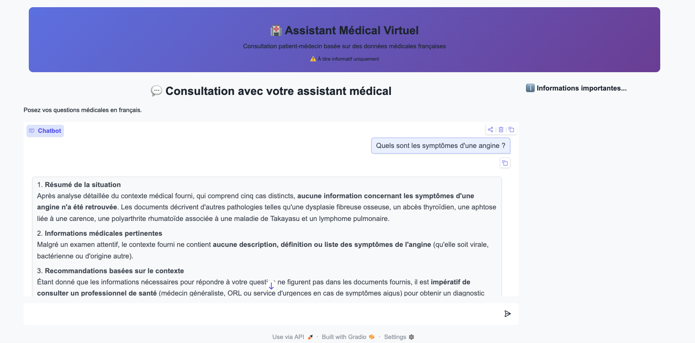
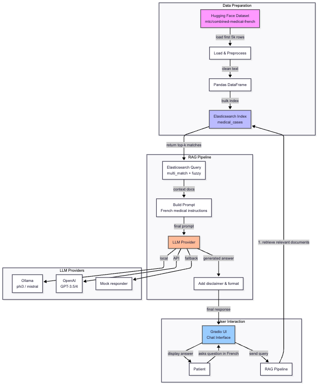

# 🇫🇷 🏥 🚑 French Medical Chatbot 🚑 🏥 🇫🇷

This repository presents a proof-of-concept (PoC) implementation of a Retrieval-Augmented Generation (RAG) system, illustrated through a case study of a medical consultation chatbot.

The project demonstrates how a RAG architecture can combine information retrieval (via a medical knowledge base) with generative language models to deliver context-aware, domain-specific responses. It focuses on simulating patient–doctor interactions, showcasing how such systems can assist in answering medical queries while leveraging structured and unstructured clinical data.



## Datasets

The dataset used in this PoC is the [Combined Medical French Dataset](https://huggingface.co/datasets/rntc/combined-medical-french), available on Hugging Face. It consists of approximately 58,000 French-language medical documents, primarily structured as detailed clinical case reports.

The dataset contains rich, real-world medical narratives describing patient histories, symptoms, diagnoses, treatments, and clinical outcomes across a wide range of conditions. These texts are typically long-form and unstructured, reflecting authentic medical documentation such as hospital case studies and clinical observations.

With data sizes ranging from 10K to 100K samples and stored in formats such as Parquet, the dataset is well-suited for large-scale processing and retrieval tasks.

In this project, the dataset serves as the knowledge base for the RAG system, enabling the chatbot to retrieve relevant medical cases and generate context-aware responses in French. Its diversity and level of clinical detail make it particularly valuable for simulating realistic patient–doctor interactions and supporting domain-specific question answering.

## Installation and Setup

### ♻️ Prerequisites

**Clone This Repository**

```bash
git clone https://github.com/tantikristanti/Generative-AI-LLMs/tree/main/french-medical-consultation
```

**Initialize Project with UV**

```bash
uv init
```

**Install Dependencies**

```bash
uv add -r requirements.txt
```

### 🔧 Optional: Install Ollama for Local LLM

```bash
curl -fsSL https://ollama.ai/install.sh | sh
ollama pull phi3  # or mistral, llama3.2
```

### 🔎 Start Elasticsearch

**Run Docker Container**

```bash
# -e "xpack.security.enabled=false"  to disable credentials

docker run -d \
  -p 9200:9200 \
  -e "discovery.type=single-node" \
  -e "xpack.security.enabled=false" \
  docker.elastic.co/elasticsearch/elasticsearch:8.11.0
```

**Or Download Elasticsearch from the Source**
[Download Elasticsearch On-Prem](https://www.elastic.co/downloads/elasticsearch)

### 🏃 Run the Application

```bash
uv run python french-medical-chatbot.py
```

## RAG Components



1. **Data Preparation**

- The medical dataset is loaded from Hugging Face.
- Documents are indexed into Elasticsearch with a French analyzer for optimal retrieval.

2. **User Interaction**

- The patient interacts through a Gradio chat interface.
- Questions must be in French (the system is designed for French medical queries).

3. **RAG Pipeline**

- The user query triggers a multi‑field, fuzzy search in Elasticsearch (top‑k relevant documents).
- Retrieved contexts are used to build a structured French prompt that includes medical disclaimers.
- The prompt is sent to an LLM (Ollama local, OpenAI, or a mock fallback).
- The answer is post‑processed (disclaimer added) and returned to the UI.

4. **LLM Providers**

- Ollama (local, free) – recommended for privacy and cost.
- OpenAI – optional, requires API key.
- Mock responder – for testing when no LLM is available.
